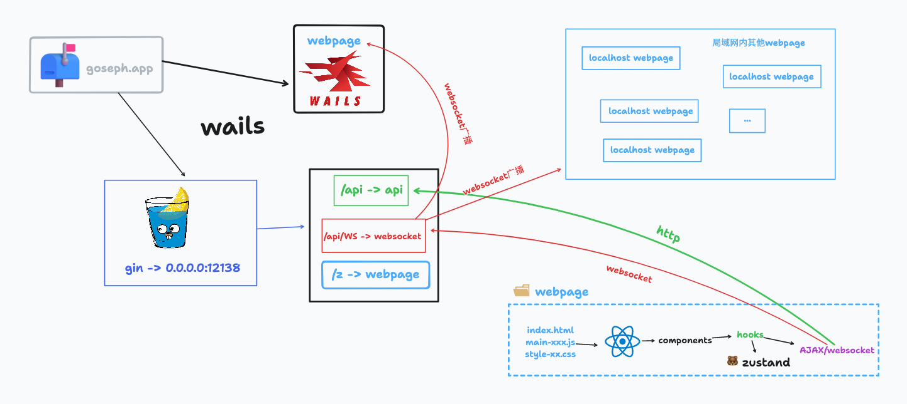

# goseph

> 这是一个利用局域网，以聊天的交互实现局域网内传输数据的桌面应用，打包应用使用[wails](https://wails.io)，后端服务使用[gin](https://gin-gonic.com)，前端使用[react](https://react.dev)

## 截图

## 大致框架

## 实现的功能

+ 局域网共享数据
+ 文件上传
  + 超大文件上传
  + 断点续传
  + 分片上传进度节流统计
  + 任务失败重试
+ websocket广播
+ 控制异步任务队列并发
+ 拖放/粘贴传输

## 学到的东西

+ golang
  + gin的使用
  + 文件（夹）系统操作
+ react
  + hook的使用
  + 动画制作
  + tsx的写法
+ 粘贴/拖放文件的处理
+ 并发任务的控制
+ 文件分片后的上传进度统计
